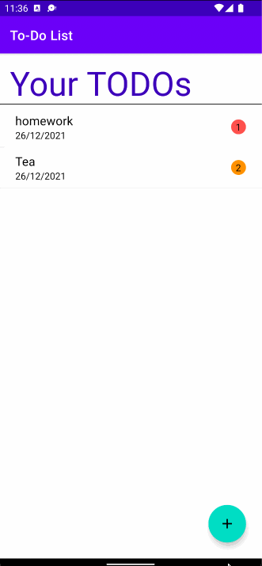

# ToDoList
 This is Component 2 For ToDoApp

My ToDoList Application is a Mobile Application that runs on Google’s Android Platform written in Java programming language . 
The IDE used for growing the app is Android Studio. It is and official IDE from google. Any android tool going for walks Android model 6.0 i.e. Lollipop or above are well suited with this app. The compatibility ratio of this app is about 98%. 
This Action Todo app allows users to create a list of tasks they want to perform on a particular day and adjust and delete tasks as needed. When a task is complete, consumers can mark the task as complete by selecting the check box next to the task on the main page.

###### Submitted by: Dhruba Sharma (7275341)

# Features
1. Minimaslistic yet elegant GUI.
3. CRUD functionality 

# Requierments 
1. Andriod Studio 4.0 or above
2. JDK version 1.8.0 or above
3. An android device running android 5.0 or above

# Framework
Model View View Model (MVVM)
> MVVM is an architectural technique used in applications to distinguish data and business logic from user interface code. With the clear separation of these components, all components of an app can be unit-tested, components can be recycled within the system or across the app, and changes to the software can be made without all the components being refactored.

# Instructions
1. Download the zip or clone repository and unzip if needed
2. Open the Project in Andriod Studio
3. Run

# Screen Shots

# License
@ Copyright 2021 Dhruba Sharma